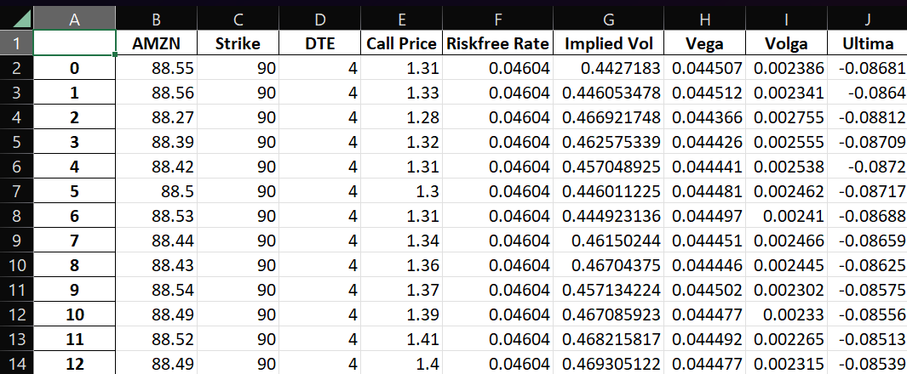
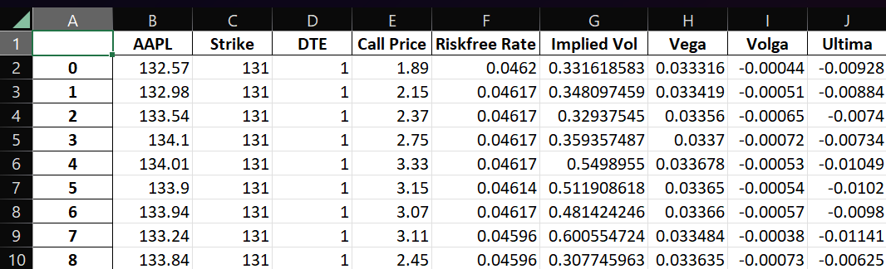

## Automated Implied Volatility Calculator

#### Brief Summary
I designed a web scraper that gathers the market price of the underlying asset, the market price of the call option, and the risk-free rate in real time. The user inputs the stock, the strike price, and the time to maturity that is of interest to them. Then, the implementation of the Newton-Raphson method (with some improvements -- see later on) calculates the implied volatility at that instant. Furthermore, vega, volga, and ultima are calculated. The program runs according to a specified time interval until the market closes. Nonetheless, it will produce a single row of data after close if the user wishes to check their current position after the trading day. All of the data is continuously placed into a dataframe that uploads to an Excel file. 

#### Code

~~~python
from cgitb import text
from importlib.resources import path
from selenium import webdriver
from selenium.webdriver.common.by import By
from time import time, sleep
from datetime import datetime
import pandas as pd
from concurrent.futures import ThreadPoolExecutor
import numpy as np
from scipy.stats import norm
from selenium.webdriver.support.ui import WebDriverWait
from selenium.webdriver.support import expected_conditions as EC

N_prime = norm.pdf
N = norm.cdf 
url = ['', '', 'https://www.wsj.com/market-data/quotes/bond/BX/TMUBMUSD03M'] 

options = webdriver.ChromeOptions()
options.add_experimental_option('excludeSwitches', ['enable-logging'])
browser = webdriver.Chrome(options=options)
executor = ThreadPoolExecutor(max_workers=20)
~~~
The setup of the web scraper along with tools needed later in the program are shown. Additionally, three global variables are declared.

~~~python
def check_time():
    now = datetime.now()
    midnight = now.replace(hour=0, minute=0, second=0, microsecond=0)
    secs = (now - midnight).seconds
    return secs

def explicit_wait(delay, xpath):
    try:
        temp = WebDriverWait(browser, delay).until(EC.visibility_of_element_located((By.XPATH, xpath)))
    except TimeoutError:
        print('Failed to locate element')
    return browser.find_element(By.XPATH, xpath).text

def find_xpath(val):
    print('\nLocating row...')
    row = 1
    xpath = '//*[@id="Col1-1-OptionContracts-Proxy"]/section/section/div[2]/div/table/tbody/tr[1]/td[6]'
    browser.get(url[1])
    q = explicit_wait(10, xpath)
    while float(q) != float(val):
        row += 1
        xpath = f'//*[@id="Col1-1-OptionContracts-Proxy"]/section/section/div[2]/div/table/tbody/tr[{row}]/td[6]'
        q = explicit_wait(10, xpath)
    print('Row located.') 
    return xpath.replace(f'{xpath[-2:-1]}', '1')

def get_price(val = 0):
    sleep(1)
    if val == 0:
        #underlying asset price
        browser.get(url[0])
        price = browser.find_element(By.XPATH, '//*[@id="quote-header-info"]/div[3]/div[1]/div[1]/fin-streamer[1]').text
    else:
        #market price of call option
        x = find_xpath(val)
        print('\nFetching call price...')
        price = explicit_wait(10, x)
        print(price)
    p = '{0:.2f}'.format(float(price))
    return float(p)

def get_rf():
    #risk-free rate
    sleep(1)
    browser.get(url[2])
    xpath = '//*[@id="quote_val"]'
    rate = explicit_wait(10, xpath)
    r = rate.replace('%', '')
    return float(r)
~~~
The function check_time() is used to determine when the market closes so that the program can terminate. I defined explicit_wait() such that a variable cannot be scraped until it is found. This is an error prevention method that has resolved the instances of empty elements being returned. The purpose of the find_xpath() function is to locate the xpath of the market price of the call option. It works by starting on the first row of the straddle table in the column "Strike" and iterating through the rows until it comes across the strike price entered by the user. Then, it returns the string of the xpath for the column "Last Price" by substituting the column number at the end of the xpath for "Strike". For get_price() there is a default argument of val = 0 so that I could combine two seemingly separate functions: one that scrapes the market price of the underlying asset and one that scrapes the market price of the call option. The function returns the former when no argument is listed (the argument is the strike price) and otherwise returns the latter using find_xpath(). Lastly, get_rf() locates and grabs the value of the risk-free rate using the third URL in the global array named url. I inserted a sleep(1) at the beginning of get_price() and get_rf() to avoid overtaxing the ThreadPoolExecutor (defined later) during long sessions. Note all of the scraped variables are initially returned as strings and converted into float values within the definitions. The functions get_price() and get_rf() are the only ones that deliver the dynamic varibles from web scraping, whereas find_xpath() utilizes web scraping to return an xpath of a dynamic variable.

~~~python
def bs_call(S, K, T, rf, sigma):
    #program handles black-scholes (european) call options
    d1 = (np.log(S / K) + (rf + sigma ** 2 / 2) * T) / sigma * np.sqrt(T)
    d2 = d1 - sigma * np.sqrt(T)
    call = S * N(d1) -  N(d2)* K * np.exp(-rf * T)
    return call

def vega(S, K, T, rf, sigma): 
    d1 = (np.log(S / K) + (rf + sigma ** 2 / 2) * T) / sigma * np.sqrt(T)
    vega = S * N_prime(d1) * np.sqrt(T)
    return vega

def volga(S, K, T, rf, sigma):
    d1 = (np.log(S / K) + (rf + sigma ** 2 / 2) * T) / sigma * np.sqrt(T)
    d2 = d1 - sigma * np.sqrt(T)
    volga = vega(S, K, T, rf, sigma) * (d1*d2)/sigma
    return volga

def ultima(S, K, T, rf, sigma):
    d1 = (np.log(S / K) + (rf + sigma ** 2 / 2) * T) / sigma * np.sqrt(T)
    d2 = d1 - sigma * np.sqrt(T)
    temp = (-1 * vega(S, K, T, rf, sigma)) / (sigma ** 2)
    ultima = temp * ((d1 * d2) * (1 - d1 * d2) + (d1 ** 2) + (d2 ** 2))
    return ultima
~~~
The formulas needed for the Newton-Raphson method are defined. Vega is the change in the value of the option with respect to a 1% change in impled volatility, volga is the change in vega with respect to implied volatility, and ultima is the change in volga with respect to implied volatility. In other words, volga and and ultima are the second and third order derivatives with respect to impled volatility. Keep in mind that I do not not multiply by .01 in vega() as this will be explained later. Volga and ultima are added to account for the cases of zero division and zero approach, and thereby improve the calculation of implied volatility. A Taylor series expansion to the third term can be rearranged such that we have two equations:
~~~math
x_1 = x_0 + 3f''(x_0)/f'''(x_0)
~~~
~~~math
x_2 = x_1 - f(x_1)/f'(x_1)
~~~
Note that the second is the exact same as the original formula for the Newton-Raphson method. The first corrects for division by zero and zero approach by returning a different initial value that should not produce an error in the second equation.

~~~python
def impvol_call(C, S, K, T, rf, err=0.0001, max=100):
    print('\nCalculating volatility using Newton-Rapshon...')

    #initial volatility estimate
    sigma = 0.3

    for i in range(max):
        #difference between calculated price and market price (error measurement)
        diff = bs_call(S, K, T, rf, sigma) - C
        print(f'difference: {diff}')
        
        #break if difference < specified 'err' (error tolerance)
        if abs(diff) < err:
            print(f'Took {i} iterations.')
            print(f'Error between market value and calculated value:  {diff}\n')
            break

        #correction for zero approach in newton-raphson (taylor series expansion and manipulation)
        if vega(S, K, T, rf, sigma) < 1:
            sigma = sigma + ((3 * volga(S, K, T, rf, sigma))/(ultima(S, K, T, rf, sigma)))

        #newton-raphson to update the estimate
        sigma = sigma - (diff / vega(S, K, T, rf, sigma))
        print(f'updated sigma: {sigma}')

    return sigma
~~~
Implied volatility is calculated in impvol_call() using the Newton-Raphson method with the adjustment I mentioned prior. The function first sets an initial volatility estimate. Then, it iterates by observing the difference between the market price of the call and calculated price of the call using the updated volatility estimate. The volatility is updated through the original Newton-Raphson formula. In the case vega() is less than 1 and zero approach or zero division may in play with respect to the regular formula, the first equation derived in the comment section above re-evaluates the volatilty such that the function can continue gracefully. We can use the conditional, vega() < 1, for better readability since the definition of vega() does not include its natural multiplicative constant of .01. Therefore, it is really ran when vega, according to its mathematical definition, is less than .01. The built-in error tolerance and iterations limit I installed are 0.0001 and 100, respectively. Hence, the function runs until an error of less than 0.0001 is obtained or until 100 iterations are performed.

~~~python
def main():
    now = datetime.now()
    date = now.strftime('%m-%d-%Y')

    stock = input('Stock: ')
    url[0] = f'https://finance.yahoo.com/quote/{stock}/'
    url[1] = f'https://finance.yahoo.com/quote/{stock}/options?p=NVDA&straddle=true'
    path = f'C:/Users/naz91/OneDrive/Documents/Projects/DailyStats/{date}-{stock}.xlsx'

    K = float(input('Strike price: '))
    dte = int(input('Days until expiration: '))
    T = dte / 252
~~~
We are now onto the running of the program. The date is retrieved merely for labeling the Excel file that the data is transferred to. Then, user inputs are collected and stored into variables necessary for calculation. Note the entry of the stock determines url[0] and url[1] as left blank in the global variable.

~~~python
    with ThreadPoolExecutor(max_workers=20) as executor:
        price = executor.submit(get_price)
        S = price.result()
        callprice = executor.submit(get_price, (K))
        C = callprice.result()
        rfrate = executor.submit(get_rf)
        rf = rfrate.result()

    print('\nDone scraping dynamic varibles.')
~~~
ThreadPoolExecutor is used to scrape the variables asynchronously. It works by employing "workers" to each function and running them simultaneously. In other words, this is a use of asynchronous waits. An asynchronous wait, in this case, accounts for the delays in loading webpages and extracting elements by their xpaths, and prevents the program from prematurely moving on to the calculations.

~~~python
    rf /= 100
    iv = impvol_call(C, S, K, T, rf)
    veg = .01 * vega(S, K, T, rf, iv)
    volg = volga(S, K, T, rf, iv)
    ult = ultima(S, K, T, rf, iv)

    df = pd.DataFrame([(S, K, dte, C, rf, iv, veg, volg, ult)], columns=[stock, 'Strike', 'DTE', 'Call Price', 'Riskfree Rate', 'Implied Vol', 'Vega', 'Volga', 'Ultima'])
    print(df)
~~~
The calculations are performed and then stored into a dataframe which is printed to the terminal. This is the initial dataframe and does not transfer to an Excel file. I made the judgement that it is not necessary to create an Excel file containing one row of data when the program is run after market close.

~~~python
    try:
        while True:
            if (check_time() > 57600):
                break

            sleep(900)

            with ThreadPoolExecutor(max_workers=20) as executor:
                price = executor.submit(get_price)
                S = price.result()
                callprice = executor.submit(get_price, (K))
                C = callprice.result()
                rfrate = executor.submit(get_rf)
                rf = rfrate.result()

            print('\nDone scraping dynamic varibles.')

            rf /= 100
            iv = impvol_call(C, S, K, T, rf)
            veg = .01 * vega(S, K, T, rf, iv)
            volg = volga(S, K, T, rf, iv)
            ult = ultima(S, K, T, rf, iv)

            df2 = pd.DataFrame([(S, K, dte, C, rf, iv, veg, volg, ult)], columns=[stock, 'Strike', 'DTE', 'Call Price', 'Riskfree Rate', 'Implied Vol', 'Vega', 'Volga', 'Ultima'])
            df = pd.concat([df, df2], ignore_index=True)
            print(df)
            df.to_excel(path)

        browser.close()

    except KeyboardInterrupt:
        #Ctrl-C terminates program (manual stop)
        exit

if __name__ == '__main__':
    main()
~~~
The remaining code enters a while loop that runs, in this built-in case, every 15 minutes until market close (or until the user presses Crtl-C). The code in the previous block is copied into the while loop. The program is designed to concatenate the prior dataframe with the new row of data and immediately send the data to the Excel file. Thus, if there were to be any error, since the Excel file is updated after each concatenation, the user would retain all of the data up to the error. That completes the code for the program, consisting of 192 lines including empty lines and comments.

#### Functionality
Below is an image of the terminal during runtime. It first collects the user input for stock, strike price, and days until expiration. Then, it scrapes the market price of the underlying asset, the market price of the call option, and the risk-free rate. In order to find the market price of the call it begins at the top row of the straddle table and iterates through the rows until it finds the strike price input by the user. The program subsequently moves over the the "Last Price" column and scrapes the option price. Lastly, it calculates and appends its findings to the dataframe.

#### Data Examples
Note the path label in the code of the program above. I have it so the Excel file is marked by the date followed by the name of the stock for organizational purposes. I provide data from two stocks on different days with different runtime intervals. 

Data from AMZN on January 9, 2023 from 2:04 p.m. to 2:16 p.m. at a runtime interval of 1 minute.

Data from AAPL on January 12, 2023 from 11:51 a.m. to 2:51 p.m. at a runtime interval of 15 minutes.

#### Upcoming Improvements
As aforementioned, the Black-Scholes formula and its derivatives with respect to implied volatility used in the program do not take into account dividend payoffs. Ergo, an easy update would be to scrape the dividend payoffs of the stock and substitute the formulas that include a measure for dividends. 
The program also only considers call options. An obvious expansion would be to insert the Black-Scholes formula for put options, update the derivatives with respect to volatility to encompass their put option alternatives, and augment functions such as get_price() and impvol_calc(). 
I do not intend to make the transition from European option to American option calculations as I was primarily focused on integrating the Newton-Raphson method with the functional improvements brought about through Taylor series expansion. That said, I plan to work on a binomial pricing model for American options in the future.
